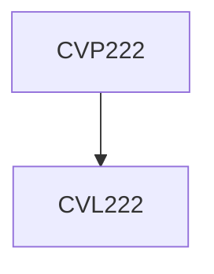

**Credits:** 1 (0-0-2)

**Prerequisites:** [[/Civil Engineering/CVL222|CVL222]] or concurrent with [[/Civil Engineering/CVL222|CVL222]]

#### Description
Visual Soil Classification; Water Content; Atterberg Limits; Grain Size Analysis; Specific Gravity; Permeability; standard proctor compaction test, consolidation test, site investigations and introduction to triaxial testing.

### Prerequisite Tree

