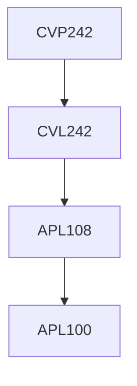

**Credits:** 1 (0-0-2)

**Prerequisites:** [[/Civil Engineering/CVL242|CVL242]] or Concurrent with [[/Civil Engineering/CVL242|CVL242]]

#### Description
Determination of forces and displacements in statically determinate and indeterminate trusses, Influence Line Diagram for Trusses, Measurement of bending moment and shear forces in beams, Determination of Elastic Properties of Beams, Verification of the Moment Area Theorem, Maxwell Betti Theorem, Influence Line Diagram for Displacement, Support Reaction, Shear Force at an Intermediate Section and Bending Moment, Determination of Carry over Factor, Verification of Carry Over Factor, Determination of displacements in curved members, Analysis of Elastically Coupled Beams, Determination of horizontal reactions in two and three hinged arches, experiment on cable structures.

### Prerequisite Tree

