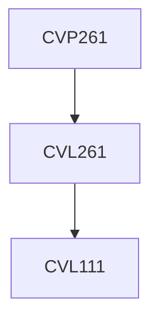

**Credits:** 1 (0-0-2)

**Prerequisites:** [[/Civil Engineering/CVL261|CVL261]] or Concurrent with [[/Civil Engineering/CVL261|CVL261]]

#### Description
Introduction to material behavior; Characterization of materials used in pavement construction: soil, aggregate, asphalt, asphalt concrete; Introduction to traffic survey methodologies; Traffic surveys: speed studies, intersection study.

### Prerequisite Tree

