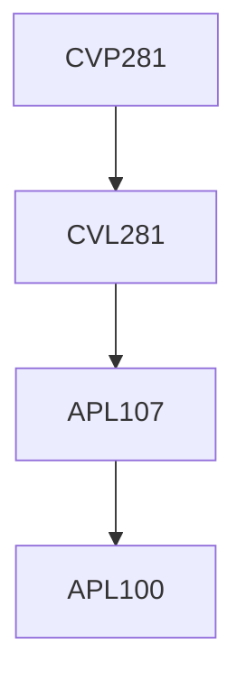

**Credits:** 1 (0-0-2)

**Prerequisites:** [[/Civil Engineering/CVL281|CVL281]] or Concurrent with [[/Civil Engineering/CVL281|CVL281]] Experiments on Open Channel Flow Hydraulics, Boundary Layer Theory, Pipe flow, Sediment transport.

#### Description
No description available.

### Prerequisite Tree

