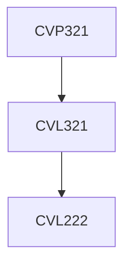

**Credits:** 1 (0-0-2)

**Prerequisites:** [[/Civil Engineering/CVL321|CVL321]] or Concurrent with [[/Civil Engineering/CVL321|CVL321]]

#### Description
Vane shear test, Direct shear test, Specimen preparation, Unconfined compression test, Unconsolidated undrained test, Consolidated drained test, Consolidated undrained test with pore water pressure measurement.

### Prerequisite Tree

