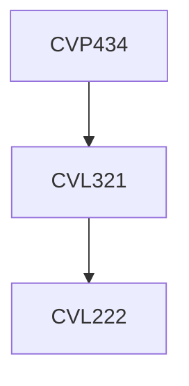

**Credits:** 2 (0-0-4)

**Prerequisites:** [[/Civil Engineering/CVL321|CVL321]]

#### Description
Seepage analysis through an earth dam. Slope stability analysis of a dam. Settlement analysis of shallow and deep foundations; Analysis and design of retaining structures; Analysing the structural forces in a tunnel lining.

### Prerequisite Tree

