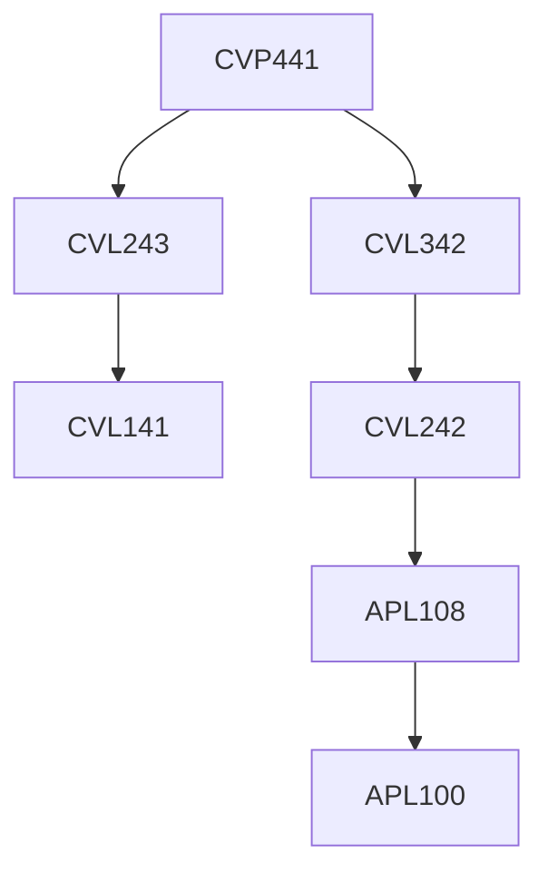

**Credits:** 1.5 (0-0-3)

**Prerequisites:** [[/Civil Engineering/CVL243 | CVL243]], [[/Civil Engineering/CVL342 | CVL342]] Part-I Concrete Structures

#### Description 
Computer-aided analysis and design of real-life reinforced concrete (RC) structure. Dimensioning of concrete elements based on modular formworks available in construction industry. Detailing of concrete elements in terms of reinforcement, curtailment, lapping, splicing of reinforcements and connection with adjoining elements in the structure; member drawings. Joint detailing from ductility view point, Indian standard (IS) code recommendations and practical intricacies involved in casting and handling of the RC members, its sequence of construction and constructability.

Part-II Steel Structures Computer-aided analysis and design of real-life steel structure. Steel member details as per shop/ field activities for welding/ bolting; i.e. fabrication (shop) drawings. Connection details, gusset plate design and detailing from ductility view point, Indian standard (IS) code recommendations and practical intricacies involved in fabrication and handling of the steel members, its sequence of erection and constructability.

### Prerequisite Tree

