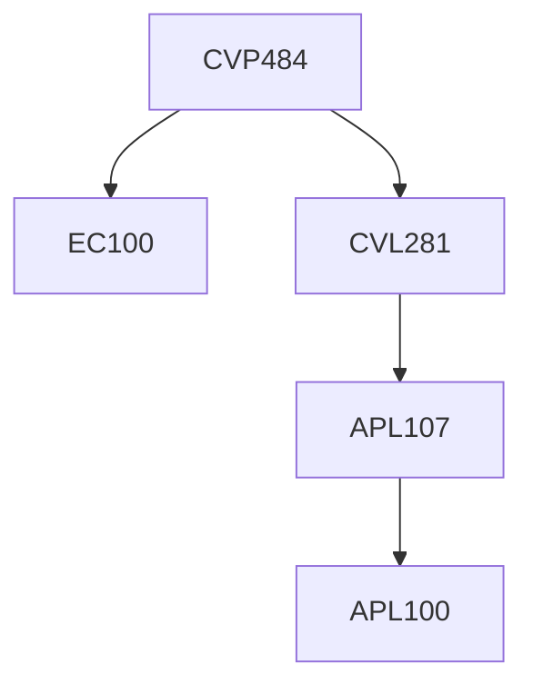

**Credits:** 3 (1-0-4)

**Prerequisites:** [[/Civil Engineering/CVL281 | CVL281]] and EC 100

#### Description 
Numerical Interpolation and Integration and application to water resources problems; Numerical solution of differential equations in Water Resources such as groundwater flow, pipe flows, open channel flows.

### Prerequisite Tree

