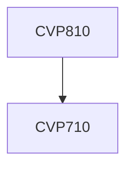

**Credits:** 3 (0-0-6)

**Prerequisites:** Rock Mechanics Lab-I [[/Civil Engineering/CVP710|CVP710]]

#### Description
Project planning,Schedule and cost assessment,DPR and GD for Major projects,Field visit, Sample collection, Scanline survey and seismic survey, Rock characterization, Determination of physical and mechanical properties of rocks, Analysis of slopes using GEOSLOPE and Analysis of tunnels using Phase2, both using the material properties determined through laboratory tests. Design of slopes and tunnels.

### Prerequisite Tree

