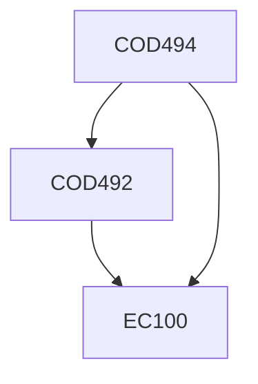

**Credits:** 8 (0-0-16)

**Prerequisites:** [[/Computer Science and Engineering/COD492|COD492]], EC 100

#### Description
The student(s) who work on a project are expected to work towards the goals and milestones set in COD492. At the end there would be a demonstration of the solution and possible future work on the same problem. A dissertation outlining the entire problem, including a survey of literature and the various results obtained along with their solutions is expected to be produced.

### Prerequisite Tree

