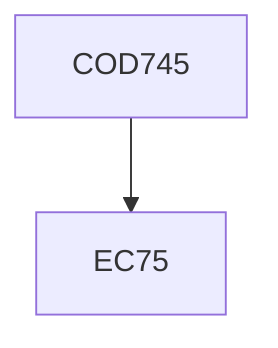

**Credits:** 3 (0-0-6)

**Prerequisites:** EC 75

#### Description
Research and development projects based on problems of practical and theoretical interest. Evaluation will be based on periodic presentations, student seminars, written reports, and evaluation of the developed system (if applicable).

### Prerequisite Tree

