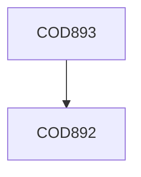

**Credits:** 14 (0-0-28)

**Prerequisites:** [[/Computer Science and Engineering/COD892|COD892]]

#### Description
The student(s) who work on a project are expected to work towards the goals and milstones set in COP893. At the end there would be a demonstration of the solution and possible future work on the same problem. A dissertation outlining the entire problem, including a survey of literature and the various results obtained along with their solutions is expected to be produced by each student.

### Prerequisite Tree

