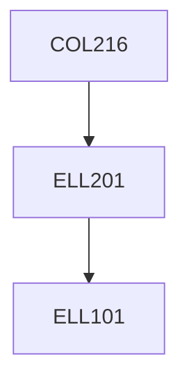

**Credits:** 4 (3-0-2)

**Prerequisites:** [[/Electrical Engineering/ELL201|ELL201]]

**Overlaps with:** ELL305

#### Description
History of computers, Boolean logic and number systems, Assembly language programming, ARM assembly language, Computer arithmetic, Design of a basic processor, Microprogramming, Pipelining, Memory system, Virtual memory, I/O protocols and devices, Multiprocessors.

### Prerequisite Tree

