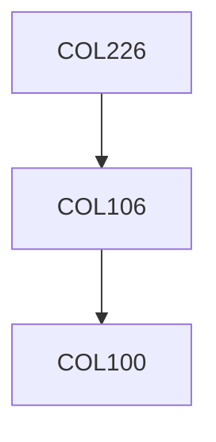

**Credits:** 5 (3-0-4)

**Prerequisites:** [[/Computer Science and Engineering/COL106|COL106]]

**Overlaps with:** COL765

#### Description
Value and state oriented paradigms. Translation. Notions of syntax and semantics of programming languages; introduction to operational/ natural semantics of functional and imperative languages. Data abstractions and control constructs; block-structure and scope, principles of abstraction, qualification and correspondence; parameter passing mechanisms; runtime structure and operating environment; practical and implementation issues in run-time systems and environment; abstract machines; features of functional and imperative languages; the un-typed and simply-typed Lambda calculus, type systems for programming languages including simple types and polymorphism; objects; classes and inheritance in object-oriented languages. Interactive programming and interfaces. The laboratory activities will involve building a variety of small interpreters for core languages in various paradigms. Tools such as lex and yacc will be introduced for front-end analysis.

### Prerequisite Tree

