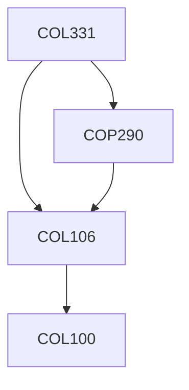

**Credits:** 5 (3-0-4)

**Prerequisites:** [[/Computer Science and Engineering/COL106|COL106]] [[/Computer Science and Engineering/COP290|COP290]]

**Overlaps with:** ELL405

#### Description
Primary UNIX abstractions: threads, address spaces, file system, devices, inter process communication; Introduction to hardware support for OS (e.g., discuss x86 architecture); Processes and Memory; Address Translation; Interrupts and Exceptions; Context Switching; Scheduling; Multiprocessors and Locking; Condition Variables, Semaphores, Barriers, Message Passing, etc.; File system semantics, design and implementation; File system Durability and Crash recovery; Security and Access Control.

### Prerequisite Tree

