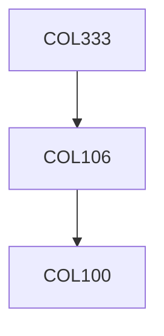

**Credits:** 4 (3-0-2)

**Prerequisites:** [[/Computer Science and Engineering/COL106|COL106]]

**Overlaps with:** COL671, COL770, ELL789

#### Description
Philosophy of artificial intelligence, problem solving, search techniques, constraint satisfaction, game playing (minimax, expectiminimax), automated planning, knowledge representation and reasoning through logic, knowledge representation and reasoning through fuzzy logic and Bayesian networks, Markov decision processes, machine learning, neural networks, reinforcement learning, soft computing, introduction to natural language processing.

### Prerequisite Tree

