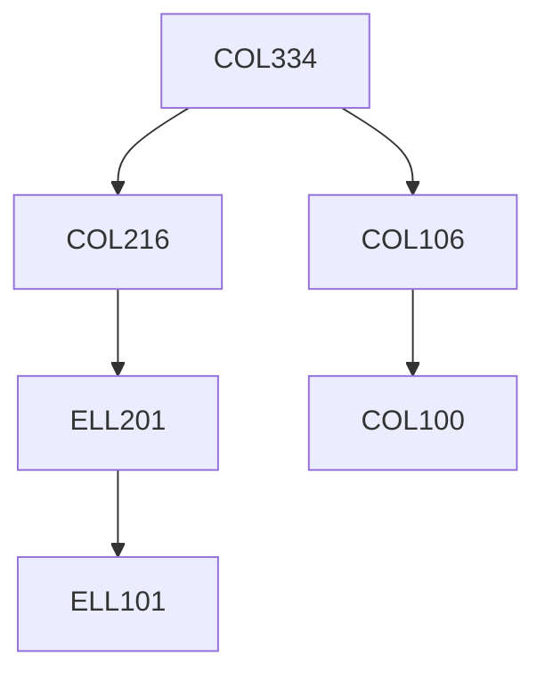

**Credits:** 4 (3-0-2)

**Prerequisites:** [[/Computer Science and Engineering/COL106|COL106]], [[/Computer Science and Engineering/COL216|COL216]]

**Overlaps with:** ELL402

#### Description
Students will be exposed to common network algorithms and protocols, including physical layer modulation (analog AM/FM, digital ASK/FSK/PSK), encoding (NRZ, Manchester, 4B/5B), link layer framing, error control, medium access control (TDMA, FDMA, CSMA/ CA, CSMA/CD), bridging, SDN, addressing (IPv4/v6), name resolution (DNS), routing (DV, LS, protocols RIP, OSPF, BGP), transport protocols (TCP), congestion avoidance (window based AIMD), and application design models (client-server, P2P, functioning of HTTP, SMTP, IMAP). Programming assignments will be designed to test network application design concepts, protocol design towards developing error detection and correction methods, efficient network utilization, and familiarization with basic tools such as ping, trace route, wires hark.

### Prerequisite Tree

