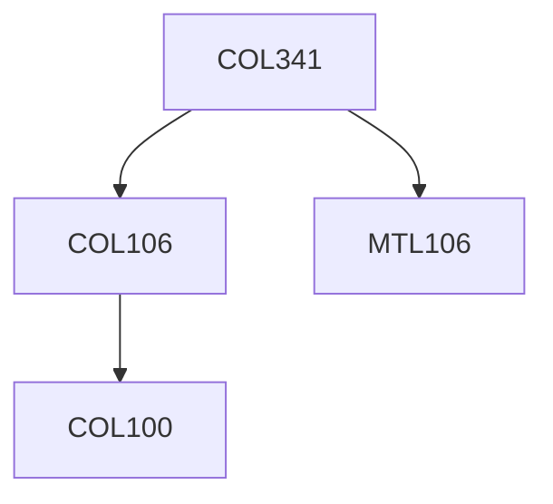

**Credits:** 4 (3-0-2)

**Prerequisites:** [[/Computer Science and Engineering/COL106|COL106]], [[/Mathematics/MTL106|MTL106]]

**Overlaps with:** ELL409, ELL784

#### Description
Supervised Learning Algorithms: 1. Logistic Regression 2.Neural Networks 3.Decision Trees 4.Nearest Neighbour 5. Support Vector Machines 6. Naive Bayes. ML and MAP estimates. Bayes’ Optimal Classifier. Introduction to Graphical Models. Generative Vs. Discriminative Models. Unsupervised learning algorithms: K-Means clustering, Expectation Maximization, Gaussian Mixture Models. PCA and Feature Selection, PAC Learnability, Reinforcement Learning. Some application areas of machine learning e.g. Natural Language Processing, Computer Vision, applications on the web. Introduction to advanced topics such as Statistical Relational Learning.

### Prerequisite Tree

