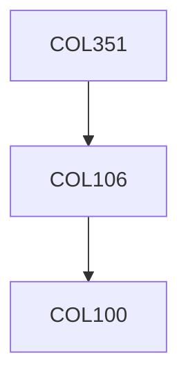

**Credits:** 4 (3-1-0)

**Prerequisites:** [[/Computer Science and Engineering/COL106|COL106]]

**Overlaps with:** MTL342, COL702

#### Description
Checking 2-edge, 2-node and strong connectivity using DFS, Strongly connected components. Greedy algorithms, minimum spanning trees (Prim/Kruskal), Union-find data structure. Matroids. Divide and conquer algorithms. Polynomial multiplication, DFT and FFT. Dynamic Programming, All pairs shortest paths (Bellman-Ford, Floyd Warshall). s-t flows, Ford-Fulkerson, Edmonds-Karp, applications of maxflow Intractability, NP-completeness, Polynomial time reductions. String matching, KMP and Rabin-Karp. Universal hashing and applications. Geometric algorithms like convex hulls, multidimensional data structures, plane sweep paradigm.

### Prerequisite Tree

