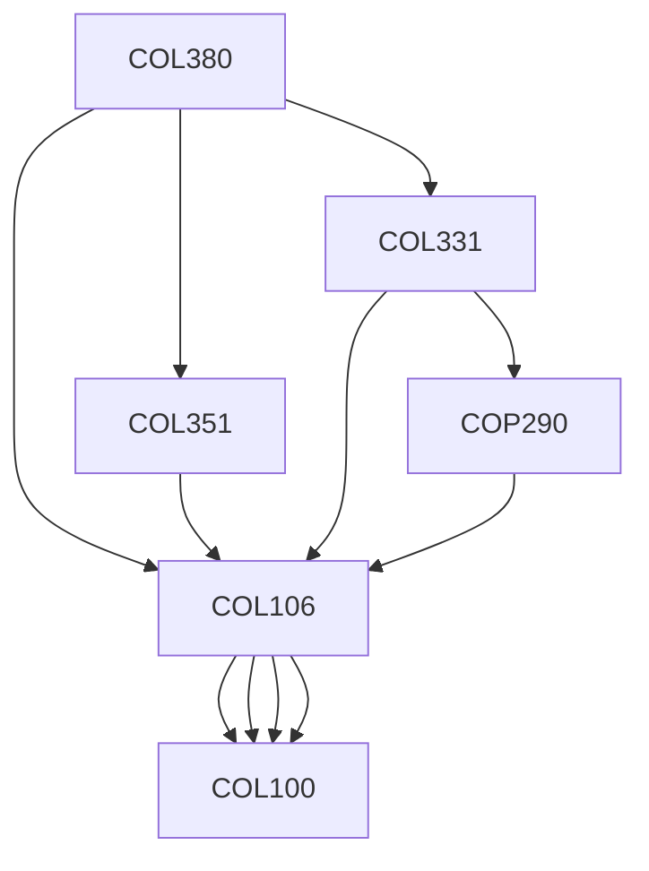

**Credits:** 3 (2-0-2)

**Prerequisites:** [[/Computer Science and Engineering/COL106 | COL106]], [[/Computer Science and Engineering/COL351 | COL351]], [[/Computer Science and Engineering/COL331 | COL331]]

**Overlaps with:** COL730

#### Description 
Concurrency, Consistency of state and memory, Parallel architecture, Latency and throughput, Models of parallel computation, performance metrics and speedup, Message-passing and Shared-memory programming paradigms, Communication networks and primitives, Concepts of Atomicity, Consensus, Conditions and Synchronization, Security, Fault tolerance, Replication of state and memory.

### Prerequisite Tree

