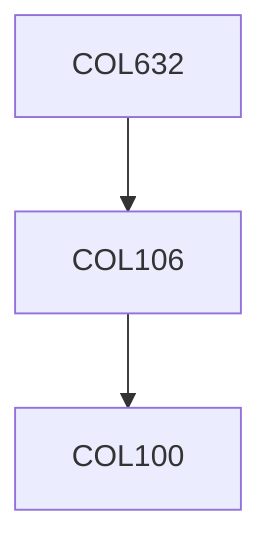

**Credits:** 4 (3-0-2)

**Prerequisites:** [[/Computer Science and Engineering/COL106|COL106]] OR Equivalent

**Overlaps with:** COL362

#### Description
Data models (ER, relational models, constraints, normalization), declarative querying (relational algebra, datalog, SQL), query processing/optimization (basics of indexes, logical/physical query plans, views) and transaction management (introduction to concurrency control and recovery). Overview of XML data management, text management, distributed data management. Course project to build a web-based database application.

### Prerequisite Tree

