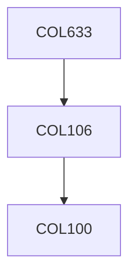

**Credits:** 4 (3-0-2)

**Prerequisites:** [[/Computer Science and Engineering/COL106|COL106]] OR Equivalent

**Overlaps with:** COL331, EEL405

#### Description
Primary UNIX abstractions: threads, address spaces, filesystem, devices, interprocess communication; Introduction to hardware support for OS (e.g., discuss x86 architecture); Processes and Memory; Address Translation; Interrupts and Exceptions; Context Switching; Scheduling; Multiprocessors and Locking; Condition Variables, Semaphores, Barriers, Message Passing, etc.; Filesystem semantics, design and implementation; Filesystem Durability and Crash recovery; Security and Access Control

### Prerequisite Tree

