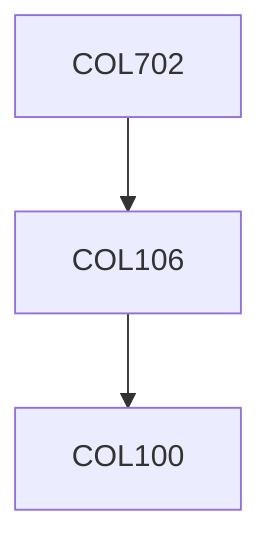

**Credits:** 4 (3-0-2)

**Prerequisites:** [[/Computer Science and Engineering/COL106|COL106]] OR Equivalent

**Overlaps with:** COL351

#### Description
Review of basic data structures and their realization in object oriented Environments. Dynamic Data structures: 2-3 trees, Redblack trees, binary heaps, binomial and Fibonacci heaps, Skip lists, Universal Hashing. Data structures for maintaining ranges, intervals and disjoint sets with applications. B-trees. Tries and suffix trees. Priority queues and binary heaps. Sorting: merge, quick, radix, selection and heap sort, Graphs: Breadth first search and connected components. Depth first search in directed and undirected graphs. Disjkra’s algorithm, Directed acyclic graphs and topological sort. Some geometric data- structures. Basic algorithmic techniques like dynamic programming and divide-and-conquer. Sorting algorithms with analysis, integer sorting. Graph algorithms like DFS with applications, MSTs and shortest paths.

### Prerequisite Tree

