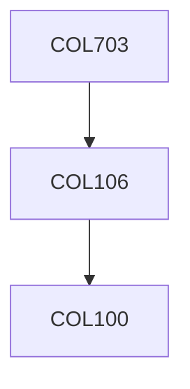

**Credits:** 4 (3-0-2)

**Prerequisites:** [[/Computer Science and Engineering/COL106|COL106]] OR Equivalent

**Overlaps with:** COL765 & COL226

#### Description
Review of the principle of mathematical induction; the principle of structural induction; review of Boolean algebras; Syntax of propositional formulas; Truth and the semantics of propositional logic; Notions of satisfiability, validity, inconsistency; Deduction systems for propositional logic; Completeness of deduction systems; First order logic (FOL); Proof theory for FOL; introduction to model theory; completeness and compactness theorems; First order theories. Programming exercises will include representation and evaluation; conversion to normal-forms; tautology checking; proof normalization; resolution; unification; Skolemization, conversion to Horn-clauses; binary-decision diagrams. Decidability, undecidability and complexity results. Introduction to formal methods, temporal/modal logics.

### Prerequisite Tree

