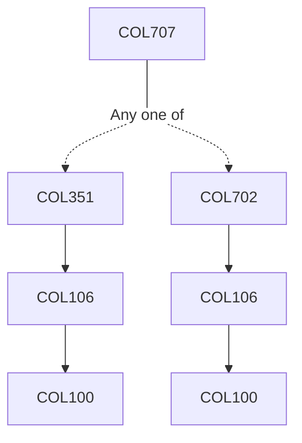

**Credits:** 4 (3-0-2)

**Prerequisites:** [[/Computer Science and Engineering/COL351|COL351]] or [[/Computer Science and Engineering/COL702|COL702]]

#### Description
systems – consequentialism, deontological, virtue ethics; Known concerns that arise at different layers in an information system – user interface design, data and privacy, algorithms and artificial intelligence, multi-stakeholder system design, and management policies; Methods to address these concerns; Assignments to analyze various layers in information systems through the lenses of different ethical theories; Design methods such as participatory design and action research; Application of design methods to formulate new information systems or improve existing ones; Political economy of technology; Theories of technology determinism and Social control of technology.

### Prerequisite Tree

