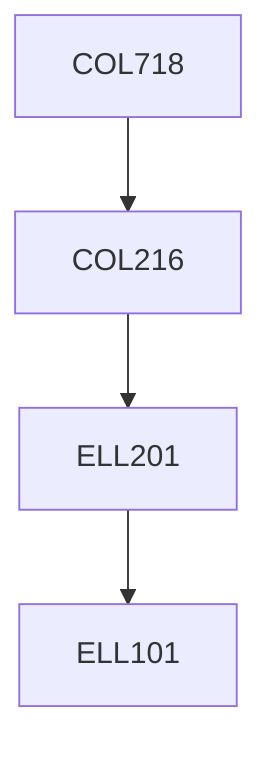

**Credits:** 4 (3-0-2)

**Prerequisites:** [[/Computer Science and Engineering/COL216|COL216]] OR Equivalent

#### Description
Classification of parallel computing structures; Instruction level parallelism - static and dynamic pipelining, improving branch performance, superscalar and VLIW processors; High performance memory system; Shared memory multiprocessors and cache coherence; Multiprocessor interconnection networks; Performance modelling; Issues in programming multiprocessors; Data parallel architectures.

### Prerequisite Tree

