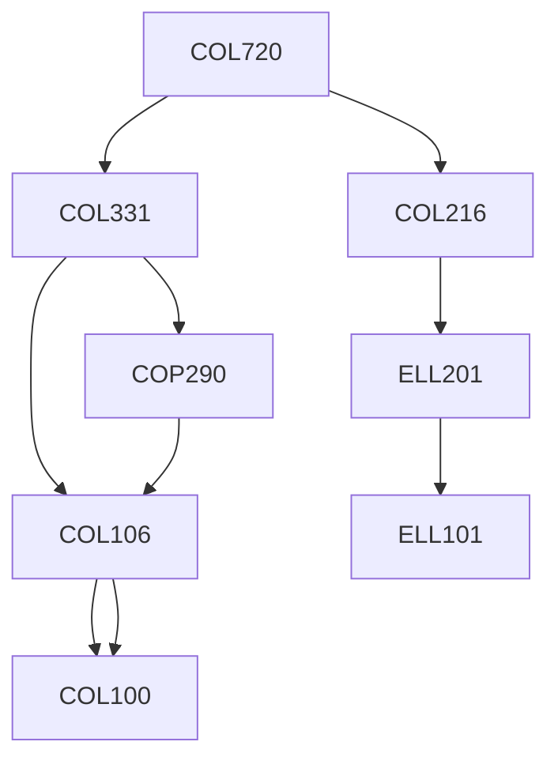

**Credits:** 4 (3-0-2)

**Prerequisites:** [[/Computer Science and Engineering/COL331 | COL331]], [[/Computer Science and Engineering/COL216 | COL216]]

#### Description 
Types of real time systems; hard and soft real time systems; reference models; priority driven approaches for real time scheduling; clock based scheduling, schedulability tests; scheduling aperiodic and sporadic jobs; slack stealing; resource access control mechanics; priority ceiling protocols; multiprocessor scheduling; scheduling flexible computations; real time communication; real time operating systems; real time embedded systems.

### Prerequisite Tree

