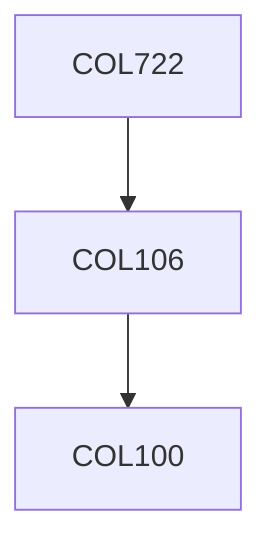

**Credits:** 3 (3-0-0)

**Prerequisites:** [[/Computer Science and Engineering/COL106 | COL106]] OR Equivalent

#### Description 
Sparsity, L1 minimization, Sparse regression, deterministic and probabilistic approaches to compressed sensing, restricted isometry property and its application in sparse recovery, robustness in the presence of noise, algorithms for compressed sensing. Applications in magnetic resonance imaging (MRI), applications in analog-to-digital conversion, low-rank matrix recovery, applications in image reconstruction.

### Prerequisite Tree

