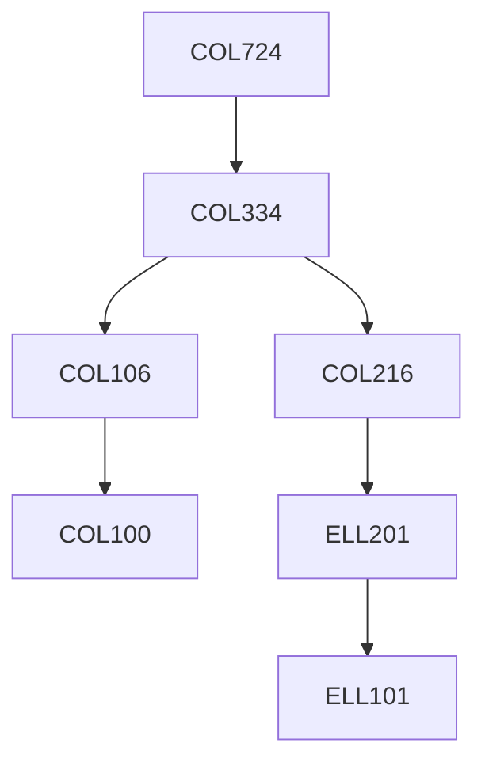

**Credits:** 4 (3-0-2)

**Prerequisites:** [[/Computer Science and Engineering/COL334|COL334]] OR Equivalent

#### Description
Review of the Internet architecture, layering; wired and wireless MAC; intra- and inter-domain Internet routing, BGP, MPLS, MANETs; error control and reliable delivery, ARQ, FEC, TCP; congestion and flow control; QoS, scheduling; mobility, mobile IP, TCP and MAC interactions, session persistence; multicast; Internet topology, economic models of ISPs/CDNs/content providers; future directions.

### Prerequisite Tree

