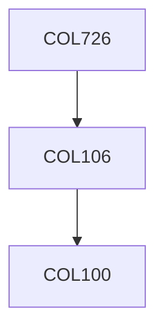

**Credits:** 4 (3-0-2)

**Prerequisites:** [[/Computer Science and Engineering/COL106|COL106]] OR Equivalent

**Overlaps with:** MTL704

#### Description
Number representation, fundamentals of error analysis, conditioning, stability, polynomials and root finding, interpolation, singular value decomposition and its applications, QR factorization, condition number, least squares and regression, Gaussian elimination, eigenvalue computations and applications, iterative methods, linear programming, elements of convex optimization including steepest descent, conjugate gradient, Newton’s method.

### Prerequisite Tree

