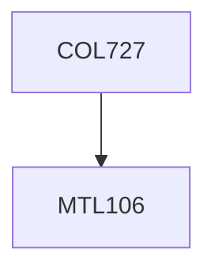

**Credits:** 3: (3-0-0)

**Prerequisites:** [[/Mathematics/MTL106|MTL106]]

#### Description
Basic of finite Markov chains; classical Markov Chains including Coupon collection, Gambler’s Ruin, Polya’s um, Birth and Death chains; Total Variation Distance; the Convergence Theorem; Mixing Time; bounding mixing time via couplings; bounding mixing time via strong stationary times; random walks on networks; bounding mixing time via hitting times; cover times; spectral bounds on mixing time; mixing time bounds via comparison between chains.

### Prerequisite Tree

