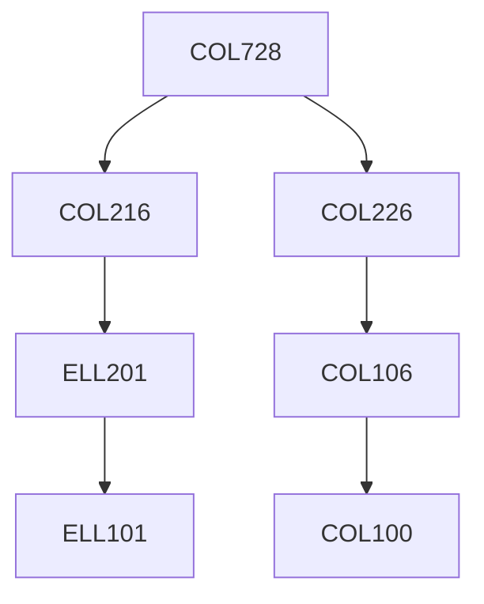

**Credits:** 4.5 (3-0-3)

**Prerequisites:** [[/Computer Science and Engineering/COL216 | COL216]], [[/Computer Science and Engineering/COL226 | COL226]] OR Equivalent

#### Description 
Compilers and translators; lexical and syntactic analysis, top-down and bottom up parsing techniques; internal form of source programs; semantic analysis, symbol tables, error detection and recovery, code generation and optimization. Type checking and static analysis. Static analysis formulated as fixpoint of simultaneous semantic equations.

Data flow. Abstract interpretation. Correctness issues in code optimizations. Algorithms and implementation techniques for type- checking, code generation and optimization. Students will design and implement translators, static analysis, type-checking and optimization. This is a praxis-based course. Students will use a variety of software tools and techniques in implementing a complete compiler.

### Prerequisite Tree

