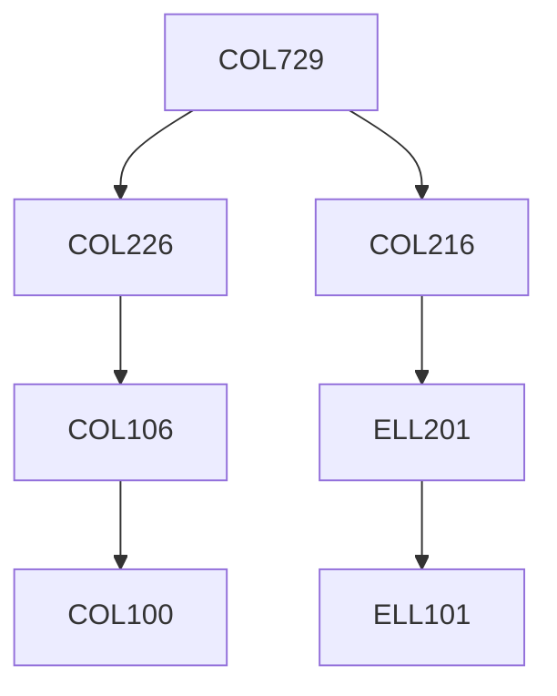

**Credits:** 4.5 (3-0-3)

**Prerequisites:** [[/Computer Science and Engineering/COL216|COL216]], [[/Computer Science and Engineering/COL226|COL226]] OR Equivalent

#### Description
Program representation – symbol table, abstract syntax tree; Control flow analysis; Data flow analysis; Static single assignment; Def-use and Use-def chains; Early optimizations – constant folding, algebraic simplifications, value numbering, copy propagation, constant propagation; Redundancy Elimination – dead code elimination, loop invariant code motion, common sub-expression elimination; Register Allocation; Scheduling – branch delay slot scheduling, list scheduling, trace scheduling, software pipelining; Optimizing for memory hierarchy – code placement, scalar replacement of arrays, register pipelining; Loop transformations – loop fission, loop fusion, loop permutation, loop unrolling, loop tiling; Function inlining and tail recursion; Dependence analysis; Just-in-time compilation; Garbage collection. Laboratory component would involve getting familiar with internal representations of compilers; profiling and performance evaluation; and the design and implementation of novel compiler optimizations.

### Prerequisite Tree

