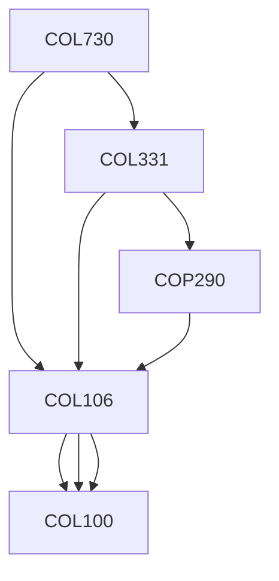

**Credits:** 4 (3-0-2)

**Prerequisites:** [[/Computer Science and Engineering/COL106 | COL106]], [[/Computer Science and Engineering/COL331 | COL331]]

#### Description 
Parallel computer organization, Parallel performance analysis, Scalability, High level Parallel programming models and framework, Load distribution and scheduling, Throughput, Latency, Memory and Data Organizations, Inter-process communication and synchronization, Shared memory architecture, Memory consistency, Interconnection network and routing, Distributed memory architecture, Distributed shared memory, Parallel IO, Parallel graph algorithms, Parallel Algorithm techniques: Searching, Sorting, Prefix operations, Pointer Jumping, Divide-and-Conquer, Partitioning, Pipelining, Accelerated Cascading, Symmetry Breaking, Synchronization (Locked/Lock-free).

### Prerequisite Tree

