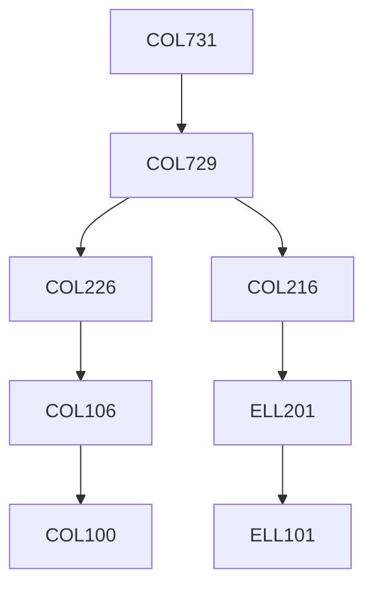

**Credits:** 4 (3-0-2)

**Prerequisites:** [[/Computer Science and Engineering/COL729|COL729]] or equivalent

#### Description
Polyhedral analysis for locality and parallelism transformations. The topics will include the affine transform theory in the polyhedral framework, space-partitioning constraints and associated code- generation algorithms, primitive affine transformations, and pipelining. Lab work will include experimentation and development within existing polyhedral analysis tools, such as LLVM's Polly; Undefined Behaviour will be discussed in the context of performance-sensitive programming languages such as C/C++/Rust/etc. The manifestation of Undefined Behaviour at the Intermediate Representation (IR) level will be discussed through examples of real-world IRs such as LLVM IR; Symbolic analysis approaches based on dataflow analysis/abstract interpretation will be introduced. Hoare logic and associated predicate transformers (weakest-precondition, strongest-postcondition) will be introduced. Optionally, algorithms for automatic inference of inductive invariants and bisimulations may be discussed. Optionally, superoptimization techniques may be discussed too.

### Prerequisite Tree

