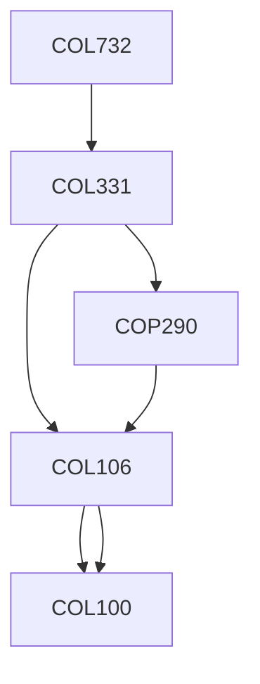

**Credits:** 4 (3-0-2)

**Prerequisites:** [[/Computer Science and Engineering/COL331 | COL331]]

#### Description 
Introduction to Virtualization and Cloud Computing; Binary Translation; Hardware Virtualization; Memory Resource Management in Virtual Machine Monitor; Application of Virtualization; Cloud-scale Data Management and Processing; I/O Virtualization.

### Prerequisite Tree

