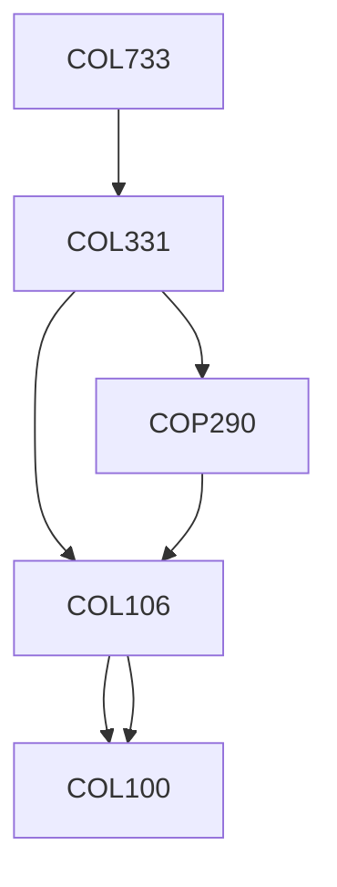

**Credits:** 4 (3-0-2)

**Prerequisites:** [[/Computer Science and Engineering/COL331 | COL331]]

#### Description 
Overview of Cloud Computing, Virtualisation of CPU, Memory and I/O Devices; Storage Virtualisation and Software Defined Storage (SDS), Software Defined Networks (SDN) and Network Virtualisation, Data Centre Design and interconnection Networks, Cloud Architectures, Public Cloud Platforms (Google App Engine, AWS, Azure), Cloud Security and Trust Management, Open Source Clouds (Baadal, Open Stack, Cloud Stack), Cloud Programming and Software Environments (Hadoop, GFS, Map Reduce, NoSQL systems, Big Table, HBase, Libvirt, OpenVswitch), Amazon (Iaas), Azure (PaaS), GAE (PaaS)

### Prerequisite Tree

