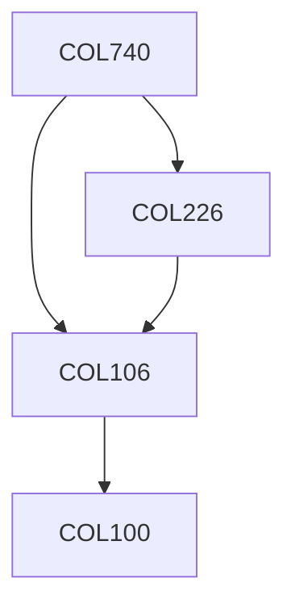

**Credits:** 4 (3-0-2)

**Prerequisites:** [[/Computer Science and Engineering/COL106|COL106]], [[/Computer Science and Engineering/COL226|COL226]]

#### Description
Introduction to Software Engineering, Software Life Cycle models and Processes, Requirement Engineering, System Models, Architectural Design, Abstraction & Modularity, Structured Programming, Object- oriented techniques, Design Patterns, Service Oriented Architecture, User Interface Design, Verification and Validation, Reliability, Software Evolution, Project Management & Risk Analysis, Software Quality Management, Configuration Management,Software Metrics, Cost Analysis and Estimation, Manpower Management, Organization and Management of large Software Projects.

### Prerequisite Tree

