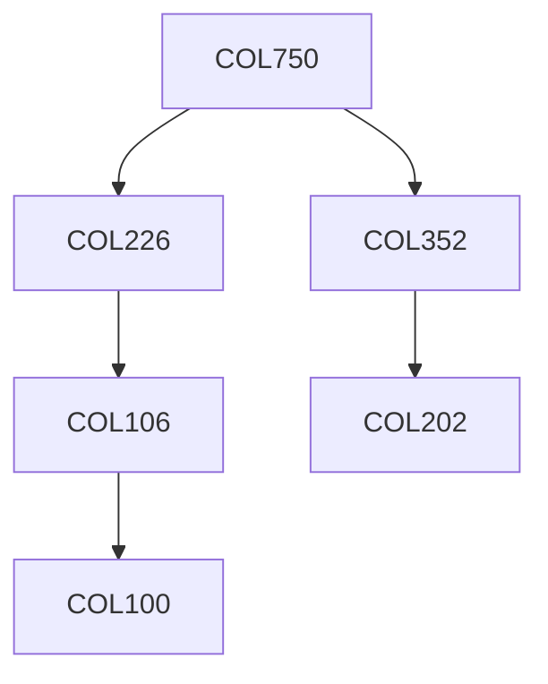

**Credits:** 4 (3-0-2)

**Prerequisites:** [[/Computer Science and Engineering/COL226|COL226]], [[/Computer Science and Engineering/COL352|COL352]] OR Equivalent

#### Description
A selection from the following topics, and experiments with the mentioned tools: Review of first-order logic, syntax and semantics. Resolution theorem proving. Binary Decision Diagrams (BDDs) and their use in representing systems. (Programming exercises coding and using logic programming frameworks). Transition systems, automata and transducers. Buechi and other automata on infinite words; Linear Time Temporal Logic (LTL), and specifying properties of systems in LTL; the relationship between temporal logic and automata on infinite words, LTL Model checking (exercises using Spin or similar tools); Computational Tree Logic (CTL and CTL*); CTL model checking (exercises); Process calculi such as CSP and CCS. Notions of program equivalence -- traces, bisimulation and other notions. Hennessy-Milner Logic (HML) and Mu calculus (exercises using tools such as CWB

-- Concurrency Work Bench). Symbolic model checking, exercises using tools such as SMV. Sat-based model checking and Davis-Putnam procedure; (exercises using tools such as nuSMV). Possible additional topics include: equational logic frameworks, real-time frameworks, reactive frameworks, pi-calculus (exercises using tools such as the Mobility Workbench), Tree automata and Weak Second-order Logic with k successors (WSkS), (exercises using Mona or similar tools).

### Prerequisite Tree

