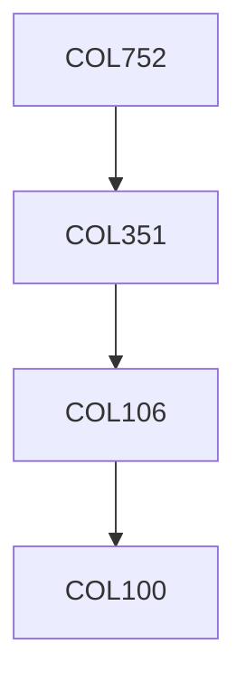

**Credits:** 4 (3-0-2)

**Prerequisites:** [[/Computer Science and Engineering/COL351|COL351]] OR Equivalent

#### Description
Geometric Fundamentals: Models of computation, lower bound techniques, geometric primitives, geometric transforms Convex hulls: Planar convex hulls, higher dimensional convex hulls, randomized, output-sensitive, and dynamic algorithms, applications of convex hull, Intersection detection: segment intersection, line sweep, map overlay, halfspace intersection, polyhedra intersection, Geometric searching: segment, interval, and priority-search trees, point location, persistent data structure, fractional cascading, range searching, nearest-neighbor searching Proximity problems: closest pair, Voronoi diagram, Delaunay triangulation and their subgraphs, spanners, well separated pair decomposition Arrangements: Arrangements of lines and hyperplanes, sweep-line and incremental algorithms, lower envelopes, levels, and zones, applications of arrangements Triangulations: monotone and simple polygon triangulations, point-set triangulations, optimization criteria, Steiner triangulation, Delaunay refinement Geometric sampling: random sampling and ε-nets, ε-approximation and discrepancy, cuttings, coresetsGeometric optimization: linear programming, LP-type problems, parametric searching, approximation techniques. Implementation Issues: robust computing, perturbation techniques, floating-point filters, rounding techniques.

### Prerequisite Tree

