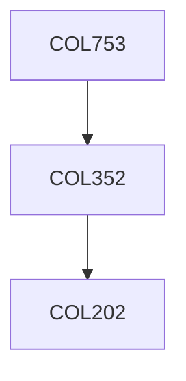

**Credits:** 3 (3-0-0)

**Prerequisites:** [[/Computer Science and Engineering/COL352|COL352]] OR Equivalent

#### Description
Modeling computation (Finite state machines, Non-determinism, Turing machines, class P etc.), NP and NP-completeness, Diagonalization (Time hierarchy and Ladner’s theorem), Space complexity (PSPACE, NL, Savitch’s theorem, Immerman-Szelepcsényi theorem etc.), Polynomial hierarchy, Boolean circuits (P/poly), Randomized classes (RP, BPP, ZPP, Adleman’s Theorem, Gács-Sipser-Lautemann Theorem), Interactive proofs (Arthur-Merlin, IP=PSPACE), Cryptography (one-way functions, pseudorandom generators, zero knowledge), PCP theorem and hardness of approximation, Circuit lower bounds (Hastad’s switching lemma), Other topics (#P, Toda’s theorem, Average- case complexity, derandomization, pseudorandom construction).

### Prerequisite Tree

