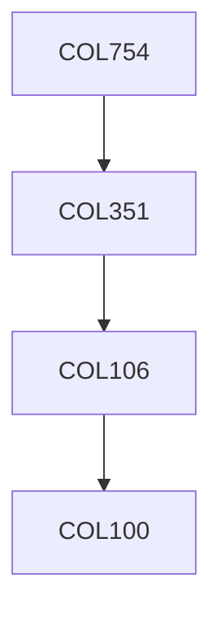

**Credits:** 3 (3-0-0)

**Prerequisites:** [[/Computer Science and Engineering/COL351|COL351]] OR Equivalent

#### Description
NP-hardness and approximation algorithms. Different kinds of approximability. Greedy algorithm and local search with applications in facility location, TSP and scheduling. Dynamic programming with applications in knapsack, Euclidean TSP, bin packing. Linear programming, duality and rounding. Applications in facility location, Steiner tree and bin packing. Randomized rounding with applications. Primal-dual algorithms and applications in facility location and network design. Cuts and metrics with applications to multi-commodity flow. Semi-definite programming and applications: max-cut, graph coloring. Hardness of approximation.

### Prerequisite Tree

