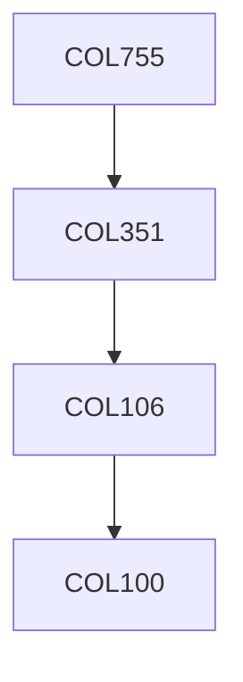

**Credits:** 3 (3-0-0)

**Prerequisites:** [[/Computer Science and Engineering/COL351|COL351]]

#### Description
Games, Strategies, Costs, Payoff, Solution Concepts. Pure and Mixed Nash Equilibria. Two player Zero-Sum Games and Proof of Nash Equilibria using Linear Programming Duality. Nash's theorem using FPT's. Complexity of finding Nash Equilibrium, Lemke Howson Algorithm, The Class PPAD. Hierarchy of Equilibria, Best-case and strong Nash Equilibria, Best-response dynamics, and no-regret dynamics. Social Choice, Arrow's and Gibbard-Satherthwaite theorems. Auctions and Optimal Mechanism Design, Myerson's lemma, VCG mechanisms. Revenue maximizing Auctions. Inefficiency of Equilibria. Price of Anarchy in network routing games, Atomic routing games, Potential function games. Mechanism Design without money: Stable matchings. Market equilibria and their computation, Fisher's and Arrow-Debreu Models, Eisenberg-Gale convex program.

### Prerequisite Tree

