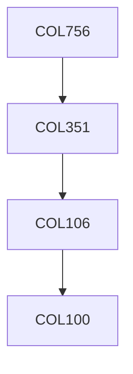

**Credits:** 3 (3-0-0)

**Prerequisites:** [[/Computer Science and Engineering/COL351|COL351]] OR Equivalent

**Overlaps with:** MTL103, MTL704

#### Description
Linear programming: introduction, geometry, duality, sensitivity analysis. Simplex method, Large scale optimization, network simplex. Ellipsoid method, problems with exponentially many constraints, equivalence of optimization and separation. Convex sets and functions – cones, hyperplanes, norm balls, generalized inequalities and convexity, perspective and conjugate functions. Convex optimization problems – quasi-convex, linear, quadratic, geometric, vector, semi- definite. Duality – Lagrange, geometric interpretation, optimality conditions, sensitivity analysis. Applications to approximation, fitting, statistical estimation, classification. Unconstrained minimization, equality constrained minimization and interior point methods. Integer Programming: formulations, complexity, duality. Lattices, geometry, cutting plane and branch and bound methods. Mixed integer optimization.

### Prerequisite Tree

