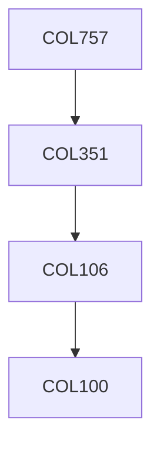

**Credits:** 4 (3-0-2)

**Prerequisites:** [[/Computer Science and Engineering/COL351|COL351]] OR Equivalent

#### Description
The RAM model and its limitations, Introduction to alternate algorithmic models Parallel models like PRAM and Interconnection networks; Basic problems like Sorting, Merging, Routing, Parallel Prefix and applications, graph algorithms like BFS, Matching Memory hierarchy models; Caching, Sorting, Merging, FFT, Permutation, Lower bounds Data Structures - searching, Priority queues Streaming Data models: Distinct items, frequent items, frequency moments, estimating norms, clustering On line algorithms: competitive ratio, list accessing, paging, k-server, load-balancing, lower-bounds.

### Prerequisite Tree

