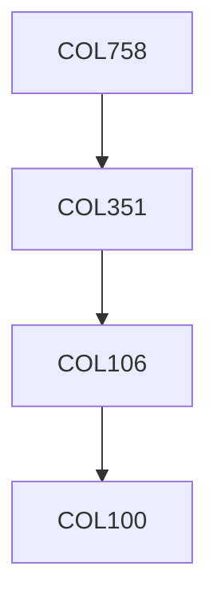

**Credits:** 4 (3-0-2)

**Prerequisites:** [[/Computer Science and Engineering/COL351|COL351]] OR Equivalent

#### Description
Advanced data structures: self-adjustment, persistence and multidimensional trees. Randomized algorithms: Use of probabilistic inequalities in analysis, Geometric algorithms: Point location, Convex hulls and Voronoi diagrams, Arrangements applications using examples. Graph algorithms: Matching and Flows. Approximation algorithms: Use of Linear programming and primal dual, Local search heuristics. Parallel algorithms: Basic techniques for sorting, searching, merging, list ranking in PRAMs and Interconnection networks.

### Prerequisite Tree

