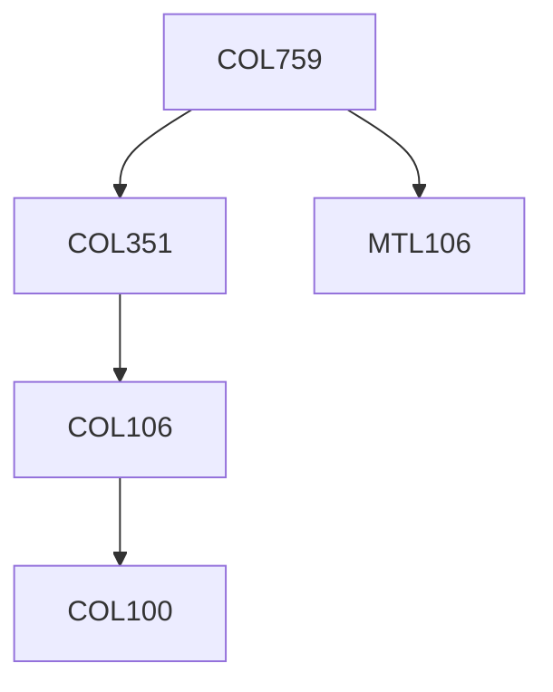

**Credits:** 3 (3-0-0)

**Prerequisites:** [[/Computer Science and Engineering/COL351|COL351]], [[/Mathematics/MTL106|MTL106]] OR Equivalent

**Overlaps with:** MTL730

#### Description
Part 1: Foundations: Perfect secrecy and its limitations, computational security, pseudorandom generators and one time encryption, pseudorandom functions, one way permutations, message authentication and cryptographic hash functions.

Part 2: Basic Constructions and proofs: Some number theory, symmetric key encryption, public key encryption, CPA and CCA security, digital signatures, oblivious transfer, secure multiparty computation. Part 3: Advanced Topics: Zero knowledge proofs, identity based encryption, broadcast encryption, homomorphic encryption, lattice based cryptography.

### Prerequisite Tree

