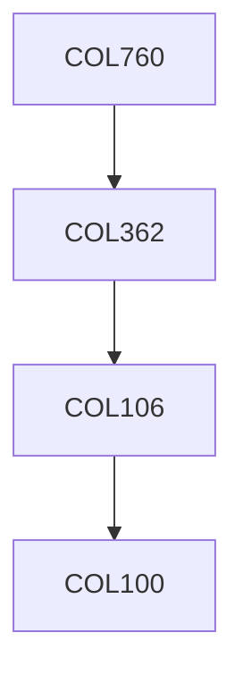

**Credits:** 4 (3-0-2)

**Prerequisites:** [[/Computer Science and Engineering/COL362 | COL362]] OR Equivalent

#### Description 
Storage and file structures, advanced query processing and optimization for single server databases, distributed data management (including distributed data storage, query processing and transaction management), web-data management (including managing the web- graph and implementation of web-search), big data systems.

### Prerequisite Tree

