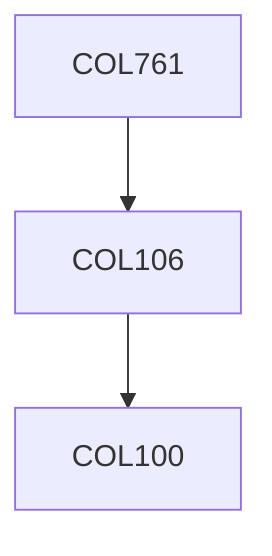

**Credits:** 4 (3-0-2)

**Prerequisites:** [[/Computer Science and Engineering/COL106|COL106]] OR Equivalent

#### Description
Association rule-mining, FP-tree, Prefix-span, Multi-support rule mining, Frequent subgraph mining (gSpan and FSG), Clustering (Agglomerative clustering, k-means, k-medoid, DBSCAN, OPTICS, CURE, BFR, MCL). Data streams (FM sketch, Reservoir sampling, top k-counting), Anomaly detection (Density based techniques, chi-square tests, p-values), Influence maximization in social networks, SimRank, random walk with restarts, PageRank, HITS.

### Prerequisite Tree

