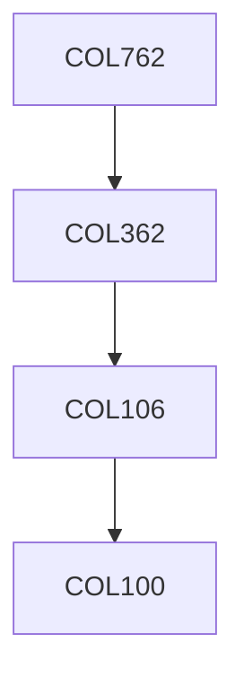

**Credits:** 4 (3-0-2)

**Prerequisites:** [[/Computer Science and Engineering/COL362|COL362]] OR Equivalent

#### Description
Review of Relational Model, Algebra and SQL, File structures, Constraints and Triggers, System Aspects of SQL, Data Storage, Representing Data Elements, Index, Multi dimensional and Bit-map Indexes, Hashing, Query Execution, Query Compiler.

### Prerequisite Tree

